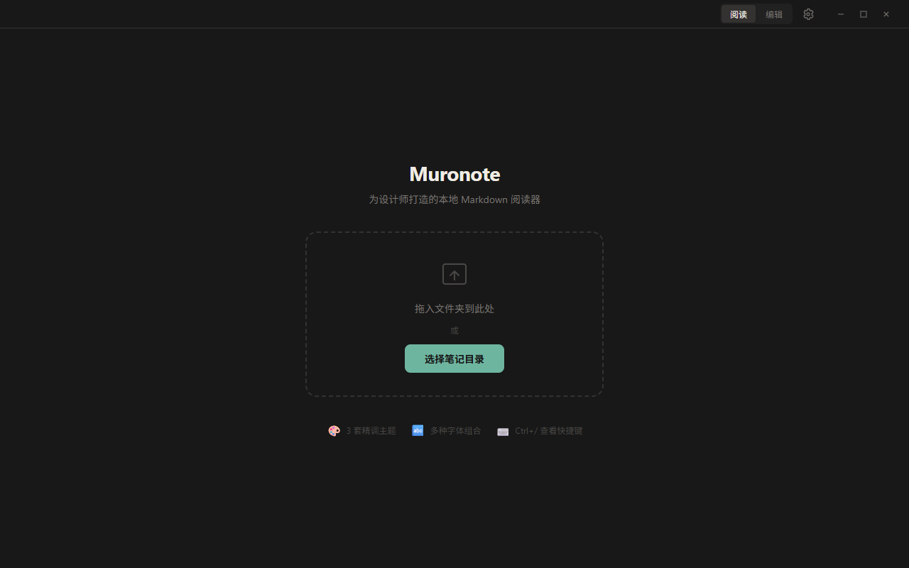
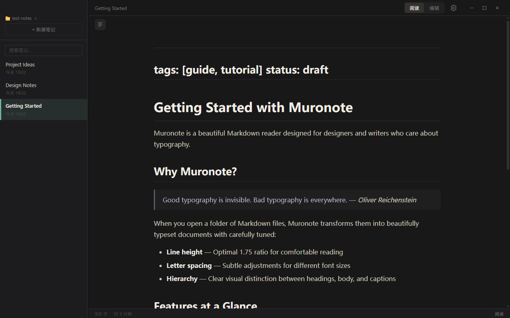
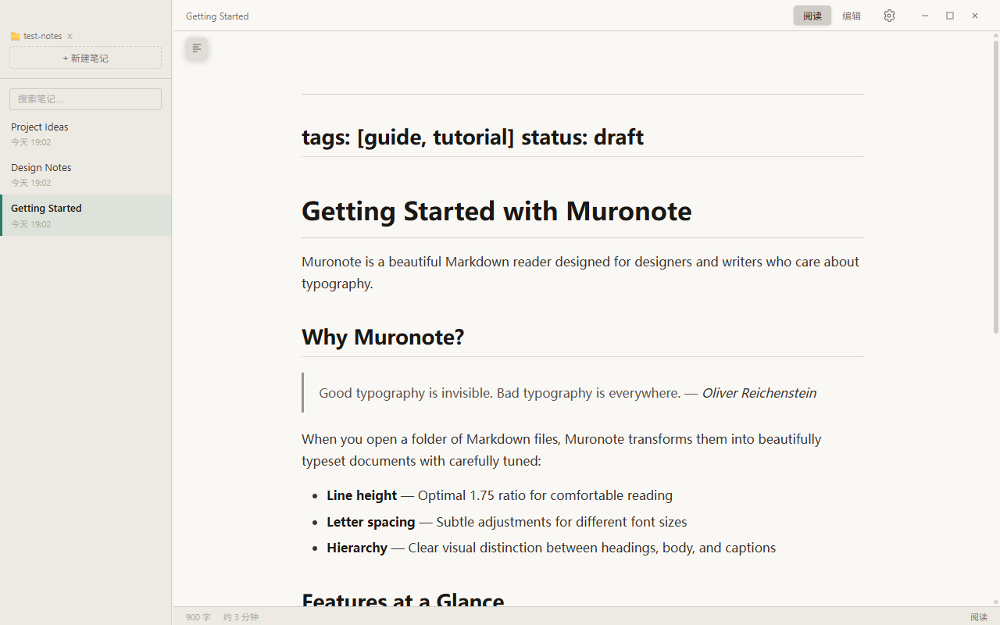
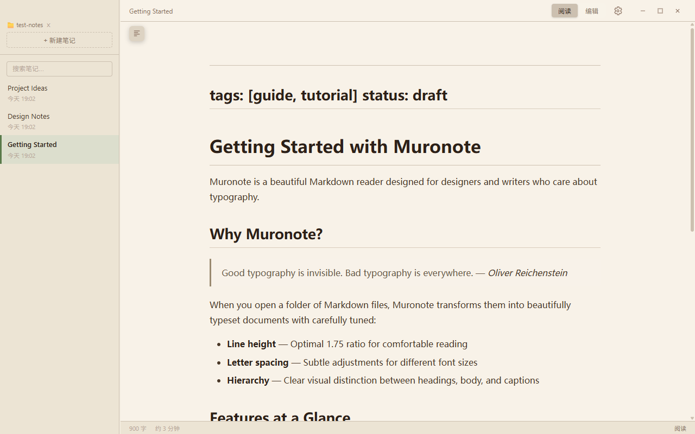
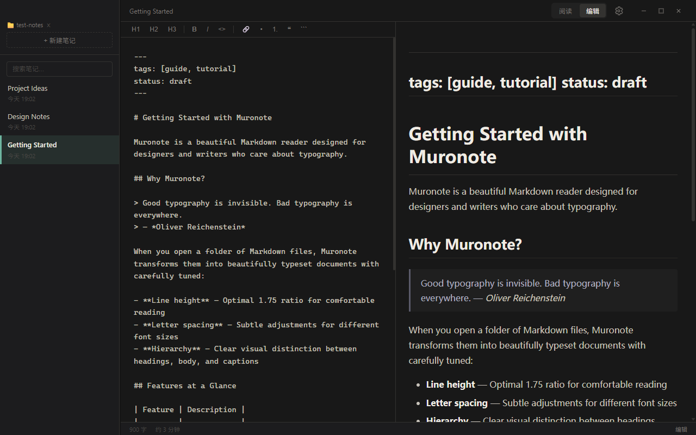
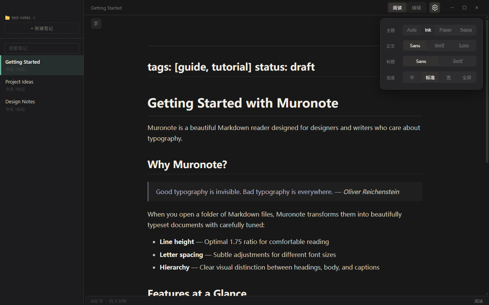

# Muronote

<p align="center">
  
</p>

<p align="center">
  <strong>为设计师打造的本地 Markdown 笔记应用</strong>
</p>

<p align="center">
  <a href="./README.md">English</a> •
  <a href="https://github.com/panic77ak/muronote/releases">下载</a> •
  <a href="#功能特性">功能特性</a> •
  <a href="#界面展示">界面展示</a>
</p>

---

打开一个文件夹，所有 `.md` 文件即刻出现在侧边栏——以出版物级别的排版体验阅读、编辑和管理笔记。

## 界面展示

### 欢迎页
> 拖入文件夹或选择笔记目录即可开始使用。



### 阅读模式 — Ink 主题（深色）
> 精心调校的行高与信息层级，呈现印刷品般的阅读体验。



### 阅读模式 — Paper 主题（浅色）
> 纯净白底，模拟纸张质感。



### 阅读模式 — Sepia 主题（暖色）
> 温暖色调，适合长文护眼阅读。



### 编辑模式
> 内置 CodeMirror 编辑器，支持语法高亮。



### 设置面板
> 主题、字体、版面宽度，一键切换。



## 功能特性

- **精致排版** — 精心调校的行高、字间距与信息层级，接近出版物的阅读体验
- **三套主题** — Ink（深墨）、Paper（纸白）、Sepia（暖棕）+ Auto 跟随系统模式
- **Markdown 编辑器** — 内置 CodeMirror 编辑器，支持实时预览
- **侧边栏 & 文件树** — 浏览和搜索文件夹中的所有笔记
- **目录导航** — 自动生成文章大纲，快速跳转
- **快速打开** — 模糊搜索，瞬间定位任何笔记（`Ctrl+P`）
- **全文搜索** — 跨笔记搜索内容
- **快捷键** — 完整的键盘快捷键支持（`Ctrl+/` 查看全部）
- **拖拽打开** — 直接拖入文件夹即可打开
- **本地优先** — 所有数据存储在本地，无需云同步
- **自动更新** — 通过 GitHub Releases 内置更新机制
- **跨平台** — 支持 Windows、macOS 和 Linux

## 安装

### 下载安装包

前往 [Releases](https://github.com/panic77ak/muronote/releases) 页面下载适合您平台的最新版本：

| 平台 | 文件 |
|------|------|
| Windows | `Muronote Setup x.x.x.exe` |
| macOS   | `Muronote-x.x.x.dmg` |
| Linux   | `Muronote-x.x.x.AppImage` |

### 从源码构建

```bash
# 克隆仓库
git clone https://github.com/panic77ak/muronote.git
cd muronote

# 安装依赖
npm install

# 开发模式运行
npm run dev

# 为当前平台打包
npm run make
```

## 开发指南

| 命令 | 说明 |
|------|------|
| `npm run dev` | 启动开发模式（支持热更新） |
| `npm run build` | 构建应用（不打包） |
| `npm run make` | 构建并打包为安装程序 |
| `npm run lint` | 运行 ESLint 检查 |
| `npm run format` | 使用 Prettier 格式化代码 |
| `npm run test:visual` | 运行 Playwright 视觉测试 |

## 技术栈

- **框架**: Electron + electron-vite
- **前端**: React 19 + TypeScript
- **编辑器**: CodeMirror 6
- **渲染**: markdown-it + highlight.js
- **状态管理**: Zustand
- **测试**: Playwright
- **打包**: electron-builder

## 快捷键

| 快捷键 | 功能 |
|--------|------|
| `Ctrl+N` | 新建笔记 |
| `Ctrl+P` | 快速打开 |
| `Ctrl+Shift+R` | 切换阅读/编辑模式 |
| `Ctrl+/` | 显示快捷键面板 |

## 开源协议

MIT
